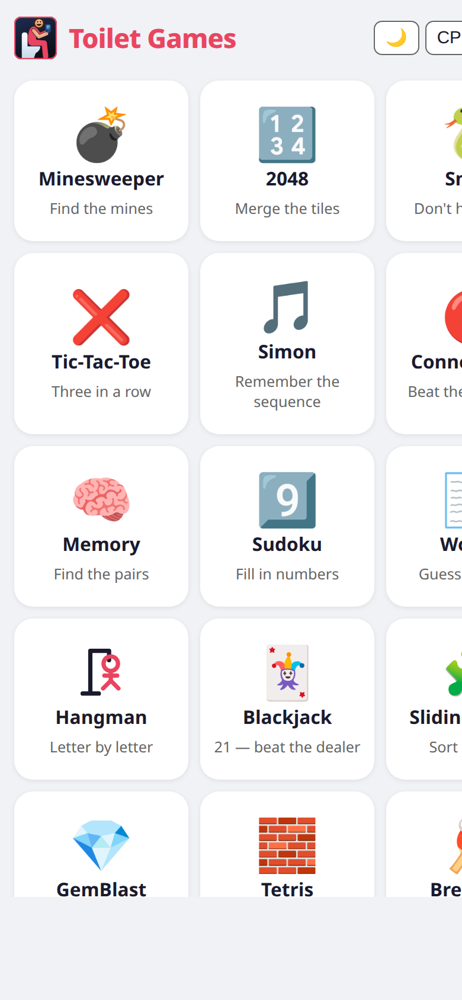
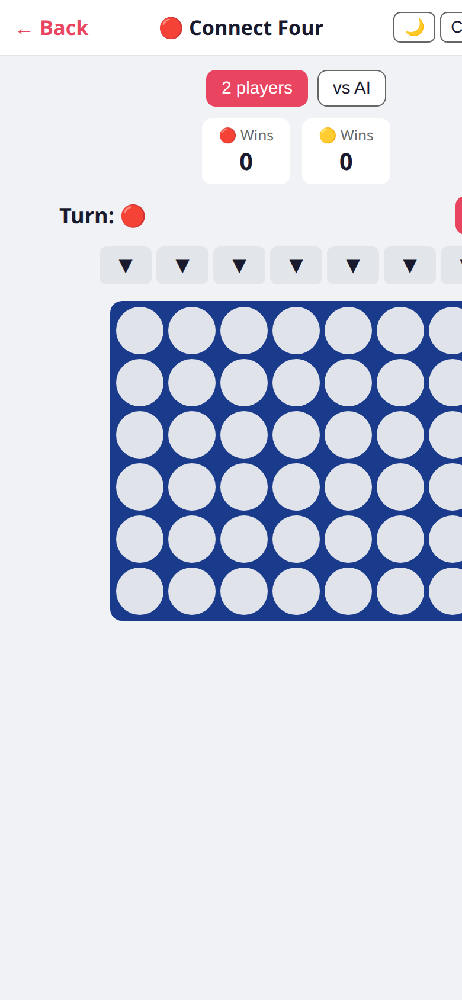
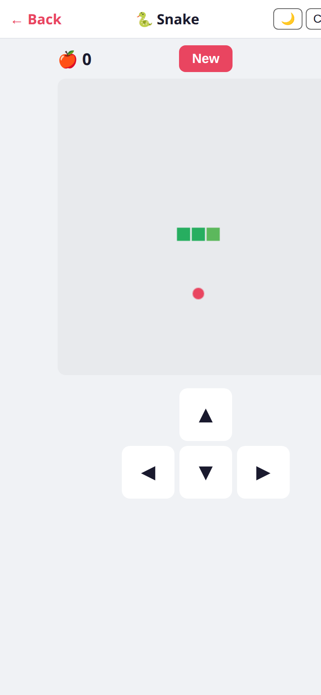
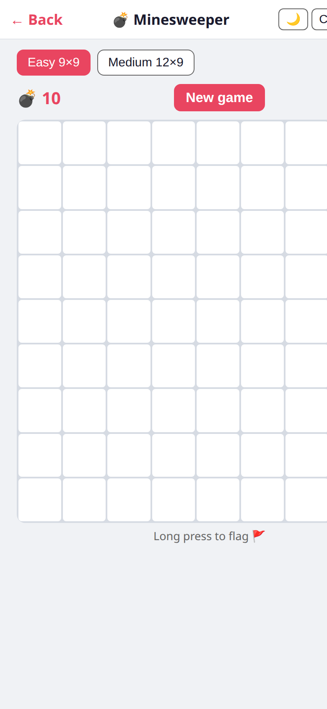
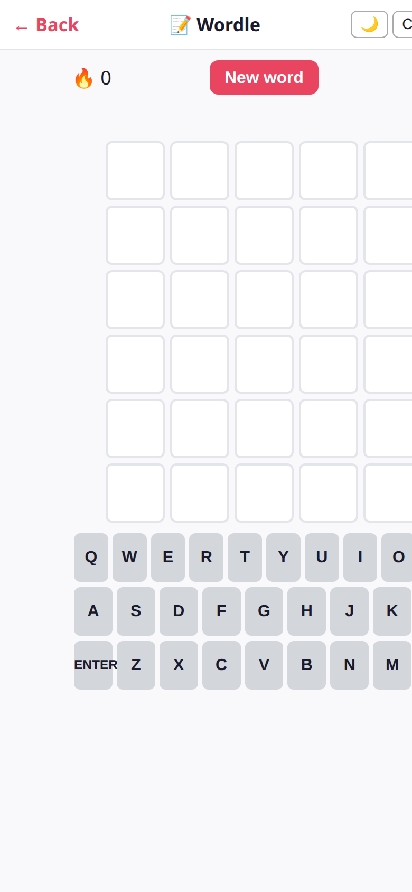
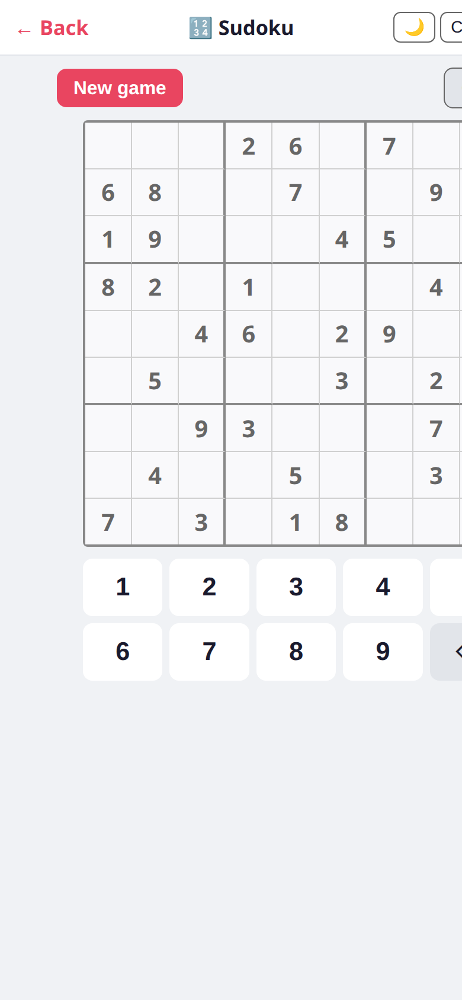

# Тоалет Игрице 🚽🎮

18 free, offline-capable browser games packed into a PWA. Built for phones — large touch targets, dark/light theme, font-size toggle, sound toggle, bilingual (Serbian / English).

**Live:** https://acosonic.github.io/toiletgames/

  

---

## Games

| Icon | Game | Serbian | Description |
|------|------|---------|-------------|
| 💣 | Minesweeper | Минерски | Classic mine-finding grid |
| 🔢 | 2048 | 2048 | Swipe to merge tiles |
| 🐍 | Snake | Змија | Eat, grow, don't crash |
| ❌ | Tic-Tac-Toe | Икс-Окс | 3-in-a-row, 2-player or vs AI |
| 🎵 | Simon | Сајмон | Repeat the colour sequence |
| 🔴 | Connect Four | Четири у низ | Drop discs, 2-player or vs AI |
| 🧠 | Memory | Мемори | Flip and match pairs |
| 9️⃣ | Sudoku | Судоку | Fill the 9×9 grid |
| 📝 | Wordle | Речко | Guess the 5-letter word |
| 🪢 | Hangman | Вешала | Letter-by-letter word puzzle |
| 🃏 | Blackjack | Блекџек | 21 — beat the dealer |
| 🧩 | Sliding Puzzle | Слагалица | 4×4 tile scramble |
| 💎 | GemBlast | Драгуљи | Match-3 gem blaster |
| 🧱 | Tetris | Тетрис | Stack the falling blocks |
| 🏓 | Breakout | Пробиј | Paddle-and-ball brick breaker |
| 🐸 | Frogger | Жабац | Cross the road safely |
| 📦 | Sokoban | Сокобан | Push boxes onto targets |
| 🚀 | Missiles | Ракете | Defend cities from incoming missiles |

---

## Screenshots

  
  
  

  
  

> Screenshots taken with Chrome headless against the live GitHub Pages build.

---

## Install as PWA

Visit the URL in **Chrome** (Android) or **Safari** (iOS) — you'll get an install prompt. Once installed the app works fully offline; the service worker pre-caches all 18 game files.

---

## Tech

- Vanilla JS / HTML / CSS — no framework, no build step, no CDN
- Each game is a **single self-contained HTML file** (inline CSS + JS)
- Service Worker (cache-first, `CACHE_VERSION` bumped on every change)
- All scores / best results stored in `localStorage`
- Web Audio API for synthesized SFX — no audio files; mutable per-game with the 🔊 button
- Bilingual: Serbian Cyrillic (`sr`) / English (`en`), switchable at runtime

---

## Inspiration & attribution

Every game here is a clone or homage to a classic. Sources and original authors:

| Game | Original | Author / Year |
|------|----------|---------------|
| Minesweeper | Microsoft Minesweeper | Robert Donner & Curt Johnson, Microsoft (1990) |
| 2048 | [2048](https://github.com/gabrielecirulli/2048) | Gabriele Cirulli (2014) — itself inspired by *Threes!* (Vollmer & Wohlwend, 2014) |
| Snake | Nokia Snake | Taneli Armanto, Nokia (1997) — traces back to *Blockade*, Gremlin (1976) |
| Tic-Tac-Toe | Noughts and Crosses | Ancient; formalized rules ~19th century |
| Simon | Simon electronic game | Ralph Baer & Howard Morrison, Milton Bradley (1978) |
| Connect Four | Connect Four | Howard Wexler & Ned Strongin, Milton Bradley (1974) |
| Memory | Concentration / Memory | Classic card game; Milton Bradley's *Memory* (1960) |
| Sudoku | Number Place / Sudoku | Howard Garns (1979); popularized by Maki Kaji / Nikoli (1984) and Wayne Gould (2004) |
| Wordle | [Wordle](https://www.nytimes.com/games/wordle) | Josh Wardle (2021), now owned by The New York Times |
| Hangman | Hangman | Traditional pencil-and-paper game, ~19th century |
| Blackjack | Vingt-et-un / Blackjack | French card game, ~17th century |
| Sliding Puzzle | 15-puzzle | Noyes Chapman (1874); famously promoted by Sam Loyd |
| GemBlast | Bejeweled | PopCap Games (2001); later *Candy Crush Saga*, King (2012) |
| Tetris | Tetris | Alexey Pajitnov, Electronika 60 (1984) |
| Breakout | Breakout | Atari (1976); Nolan Bushnell, Steve Wozniak |
| Frogger | Frogger | Konami (1981) |
| Sokoban | Sokoban (倉庫番) | Hiroyuki Imabayashi, Thinking Rabbit (1981) |
| Missiles | Missile Command | Dave Theurer, Atari (1980) |

All implementations are written from scratch in vanilla JS — no game engine, no copied code.
