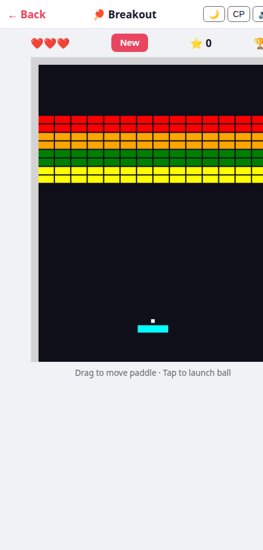

# Toilet Games 🚽🎮

18 free, offline-capable browser games as a PWA — built for phones. Large touch targets, dark/light theme toggle, font-size toggle, sound toggle (🔊/🔇), fully bilingual (Serbian / English).

**Play now:** https://acosonic.github.io/toiletgames/

  

---

## Games

| Icon | Game | Description |
|------|------|-------------|
| 💣 | Minefield | Clear the grid without hitting a mine |
| 🔢 | 2048 | Swipe to merge tiles and reach 2048 |
| 🐍 | Snake | Eat apples, grow, don't crash into yourself |
| ❌ | Tic-Tac-Toe | Three in a row — 2 players or vs AI |
| 🎵 | Echo | Watch and repeat the colour sequence |
| 🔴 | Drop Four | Drop discs to get four in a row — 2 players or vs AI |
| 🧠 | Pairs | Flip cards and find all matching pairs |
| 9️⃣ | Sudoku | Fill the 9×9 grid with numbers 1–9 |
| 📝 | Letterbox | Guess the hidden 5-letter word in 6 tries |
| 🪢 | Hangman | Guess the word letter by letter |
| 🃏 | Blackjack | Hit or stand — beat the dealer to 21 |
| 🧩 | Sliding Puzzle | Scrambled 4×4 tiles — sort them into order |
| 💎 | GemBlast | Match 3+ gems, chain combos before time runs out |
| 🧱 | Blockfall | Stack the falling tetrominoes, clear lines |
| 🏓 | Brick Bash | Bounce the ball, smash all the bricks |
| 🐸 | Road Hop | Guide the frog safely across the road |
| 📦 | Box Pusher | Push all boxes onto their target squares |
| 🚀 | Missiles | Shoot down incoming missiles before they hit the cities |

---

## Screenshots

  
  
  

  
  
  

---

## Install as PWA

Open the link in **Chrome** (Android) or **Safari** (iOS) and tap the install banner. Once installed the app runs fully offline — the service worker pre-caches all 18 game files on first visit.

---

## Tech

- **Vanilla JS / HTML / CSS** — no framework, no build step, no CDN dependencies
- Each game is a **single self-contained HTML file** (inline CSS + JS, ~200–400 lines)
- **Service Worker** with cache-first strategy; `CACHE_VERSION` bumped on every release
- **Web Audio API** for all sound effects — synthesized with oscillators, no audio files shipped
- Sound mutable per-game with the 🔊/🔇 toggle; preference saved in `localStorage`
- Scores and personal bests stored in `localStorage`
- Bilingual UI (Serbian Cyrillic / English), toggled at runtime and persisted

---

## Inspiration & attribution

Every game is a from-scratch clone of a classic. No game engines, no copied code.

| Game | Original | Author / year |
|------|----------|---------------|
| Minefield | Microsoft Minesweeper | Robert Donner & Curt Johnson, Microsoft (1990) |
| 2048 | [2048](https://github.com/gabrielecirulli/2048) | Gabriele Cirulli (2014) — inspired by *Threes!*, Vollmer & Wohlwend (2014) |
| Snake | Nokia Snake | Taneli Armanto, Nokia (1997) — descended from *Blockade*, Gremlin (1976) |
| Tic-Tac-Toe | Noughts and Crosses | Ancient; pencil-and-paper rules well established by the 19th century |
| Echo | Simon electronic game | Ralph Baer & Howard Morrison, Milton Bradley (1978) |
| Drop Four | Connect Four | Howard Wexler & Ned Strongin, Milton Bradley (1974) |
| Pairs | Concentration / Memory | Classic card game; Milton Bradley's *Memory* board game (1960) |
| Sudoku | Number Place | Howard Garns (1979); popularised as Sudoku by Maki Kaji / Nikoli (1984) |
| Letterbox | [Wordle](https://www.nytimes.com/games/wordle) | Josh Wardle (2021), acquired by The New York Times (2022) |
| Hangman | Hangman | Traditional pencil-and-paper game, ~19th century |
| Blackjack | Vingt-et-un / Blackjack | French card game, ~17th century |
| Sliding Puzzle | 15-puzzle | Noyes Chapman (1874); popularised by Sam Loyd |
| GemBlast | Bejeweled | PopCap Games (2001); later *Candy Crush Saga*, King (2012) |
| Blockfall | Tetris | Alexey Pajitnov, Electronika 60 (1984) |
| Brick Bash | Breakout | Atari (1976); Nolan Bushnell, with hardware by Steve Wozniak |
| Road Hop | Frogger | Konami (1981) |
| Box Pusher | Sokoban (倉庫番) | Hiroyuki Imabayashi, Thinking Rabbit (1981) |
| Missiles | Missile Command | Dave Theurer, Atari (1980) |
